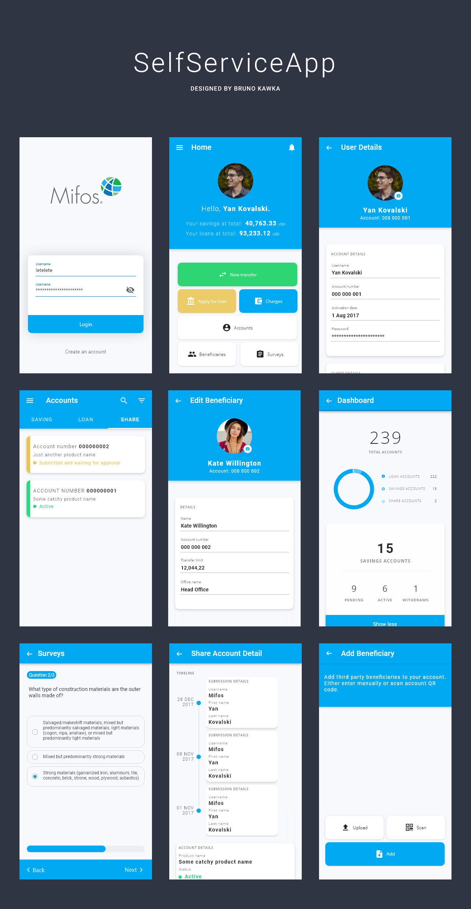

<h2 align="center"><b>MifosMobile UI/UX</b></h2>
<h4 align="center">This repository contains all design files and design flow descriptions made due to the Google Code In 2018 tasks</h4>

| Layout name | URL |
| ----------- | --- |
| Login | [open](./layout_parts/login) |
| Home | [open](./layout_parts/home) |
| User Details | [open](./layout_parts/user_details) |
| Beneficary Details | [open](./layout_parts/beneficiary_details) |
| Apply Saving accounts | [open](./layout_parts/apply_savings_account) |
| Apply For Loan | [open](./layout_parts/apply_for_loan) |
| Add Beneficiary / Select method | [open](./layout_parts/add_beneficiary) |
| Add Beneficiary / Add manualy | [open](./layout_parts/add_beneficary_manualy) |
| Accounts, Share Account Details | [open](./layout_parts/account_details) |
| Account Dashboard | [open](./layout_parts/account_dashboard) |
| Surveys | [open](./layout_parts/surveys) |
